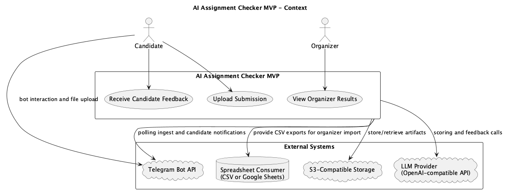
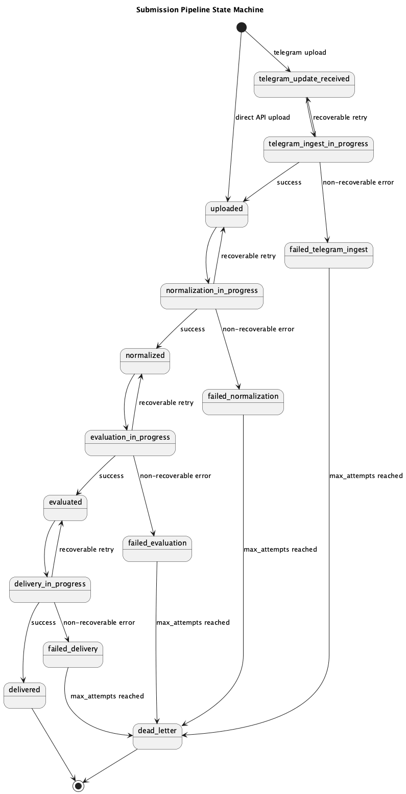

# AI Assignment Checker

`AI Assignment Checker` - MVP-система для автоматической проверки тестовых заданий кандидатов в Учебный центр.

Проект принимает работу кандидата, проводит ее через конвейер нормализации, LLM-оценки и доставки результата, а затем выдает:

- итоговую оценку по шкале `1-10`;
- структурированную обратную связь для команды Учебного центра;
- понятную и корректную обратную связь для кандидата;
- machine-readable результат для выгрузки в таблицу;
- payload, пригодный для доставки через Telegram-бота.

## Какую задачу решает проект

Система закрывает эту задачу так:

1. принимает ответы кандидатов через API или Telegram entrypoint;
2. приводит разнородные входные данные к единому нормализованному представлению;
3. оценивает решение по versioned `task_schema` и критериям задания;
4. детерминированно считает финальный балл `1-10`;
5. формирует два разных вида фидбэка из одного evaluation result;
6. подготавливает результаты для организаторов в CSV/табличном виде;
7. подготавливает краткий кандидатский результат для доставки через бота.

Идея MVP: проверять не только вручную выбранные работы, а все поступившие отправки, сохраняя прозрачность, воспроизводимость и пригодность результата для операционного процесса.

## Для кого это решение

- команда Учебного центра: получает структурированную техничную оценку, экспорт и trace по стадиям;
- кандидаты: получают понятную развивающую обратную связь;
- HR и интервьюеры: получают единый и воспроизводимый формат результата для принятия решений;
- инженерная команда: получает прозрачный pipeline с versioned контрактами, retry semantics и audit trail.

## Что система выдает на выходе

Для каждой submission MVP формирует:

- `score_1_10` - итоговую оценку;
- `organizer_feedback` - сильные стороны, проблемы, рекомендации в структурированном виде;
- `candidate_feedback` - краткое и корректное объяснение результата без токсичности;
- `ai_assistance` - вероятностный сигнал с `likelihood`, `confidence` и disclaimer;
- `score_breakdown` - разложение по задачам и критериям;
- поля воспроизводимости: `chain_version`, `spec_version`, `model`, `response_language` и связанный `llm_runs` ledger.

Это делает оценку не просто числом, а объяснимым и интегрируемым результатом.

## Сквозной сценарий

### 1. Вход кандидата

Есть два основных пути входа:

- прямой API ingest: кандидат и задание регистрируются через API, затем файл загружается через `POST /submissions/file`;
- Telegram entrypoint: кандидат отправляет `/start`, бот возвращает подписанную ссылку `/candidate/apply`, а дальнейшая загрузка происходит через web/API flow.

Важно: `worker-ingest-telegram` в MVP не создает submissions и не пишет `raw/` артефакты сам; он только брокерит вход в web flow.

### 2. Нормализация

`worker-normalize` забирает отправки в состоянии `uploaded`, читает `raw/` артефакт, извлекает или приводит содержимое к нормализованному виду и сохраняет результат в `normalized/`.

### 3. Оценка

`worker-evaluate` читает нормализованный артефакт, запускает rubric-driven LLM chain, валидирует строгий JSON-ответ и сохраняет:

- оценку и score breakdown в `evaluations`;
- metadata выполнения в `llm_runs`;
- обогащенный feedback для организатора и кандидата.

Финальный балл считается детерминированной пост-обработкой по `task_schema`, а не произвольным текстовым ответом модели.

### 4. Доставка и экспорт

`worker-deliver` подготавливает и отправляет кандидатский payload через Telegram, а API может сформировать CSV-экспорт для организаторов через `POST /exports` и `GET /exports/{export_id}/download`.

## Архитектура MVP

### Контекстная схема



### State machine пайплайна




## Архитектурные принципы

- Python 3.12 + FastAPI + worker roles с единым entrypoint `app/main.py`;
- один runtime image, разные роли через `--role`;
- Postgres - system of record для состояния, metadata и lineage;
- S3-compatible storage - для `raw/`, `normalized/`, `exports/`, `eval/`;
- stage-based pipeline: ingest -> normalize -> evaluate -> deliver;
- строгие слойные границы: `api/services/workers -> domain contracts`;
- воспроизводимость и auditability: versioned scoring inputs, typed contracts, `llm_runs` ledger;
- отказоустойчивость через polling workers, lease ownership, retry и `dead_letter`.

Подробные границы слоев описаны в `app/ARCHITECTURE.md`, а точки расширения - в `app/COMPONENTS.md`.

## Роли рантайма

Канонический набор application roles:

- `api`
- `worker-ingest-telegram`
- `worker-normalize`
- `worker-evaluate`
- `worker-deliver`

`migrator` является отдельным внешним one-shot сервисом и не считается app role.

## Жизненный цикл submission

Основные состояния в MVP:

- `uploaded`
- `normalization_in_progress`
- `normalized`
- `evaluation_in_progress`
- `evaluated`
- `delivery_in_progress`
- `delivered`
- `failed_normalization`
- `failed_evaluation`
- `failed_delivery`
- `dead_letter`

В Telegram entry flow дополнительно используются состояния ingest-этапа, но direct upload path стартует с `uploaded`.

Worker-паттерн одинаковый для всех stage workers:

1. `claim_next(...)`
2. `process(claim)`
3. `link_artifact(...)` при необходимости
4. `finalize(...)`

Конкурентная обработка строится на `SELECT ... FOR UPDATE SKIP LOCKED`, lease metadata (`claimed_by`, `claimed_at`, `lease_expires_at`) и reclaim просроченных claim-ов.

## Данные и артефакты

### Postgres хранит

- `candidates`, `candidate_sources`;
- `assignments` с обязательными `language` и `task_schema`;
- `submissions` и stage retry metadata;
- `submission_sources` и provenance;
- `artifacts`;
- `evaluations`;
- `llm_runs`;
- `deliveries`.

### S3-compatible storage хранит

- `raw/` - исходные файлы кандидатов;
- `normalized/` - нормализованные представления;
- `exports/` - CSV для организаторов;
- `eval/` - eval reports и metric snapshots.

## Почему результат воспроизводим

Проект делает акцент не только на автоматизации, но и на воспроизводимости оценки.

Для каждого evaluation run сохраняются:

- `chain_version`;
- `spec_version`;
- `provider`;
- `model`;
- `api_base`;
- `response_language`;
- `temperature`;
- `seed` при поддержке провайдера.

Финальный `score_1_10` считается детерминированно из task-level и criterion-level результатов по assignment-owned `task_schema`. Это помогает объяснить, почему поставлена именно такая оценка, и сравнивать версии scoring chain между собой.

## Текущий статус MVP

В репозитории уже есть рабочий архитектурный каркас и значимая часть runtime-контрактов:

- единая точка входа приложения с role flags;
- fail-fast startup validation и runtime config validation;
- health/readiness endpoints;
- layered architecture с interface-first контрактами;
- worker loop с claim/process/finalize и lease heartbeat;
- onboarding контракты для candidates и assignments;
- typed OpenAPI/Swagger схемы;
- synthetic in-process pipeline для инфраструктурной проверки;
- Docker Compose baseline с внешним migrator;
- локальный запуск через `uv` и `.venv`.

Часть production-grade hardening остается следующими инкрементами: расширение conversational Telegram flow, richer eval harness, отдельный dead-letter operational flow и дальнейшее усиление quality gates.

## Быстрый старт

### 1. Подготовить окружение

```bash
cp .env.example .env
uv venv .venv
uv sync --all-groups
```

### 2. Запустить API

```bash
uv run python -m app.main --role api
```

### 3. Запустить нужные worker-роли

```bash
uv run python -m app.main --role worker-normalize
uv run python -m app.main --role worker-evaluate
uv run python -m app.main --role worker-deliver
```

Для Telegram entry flow дополнительно нужен:

```bash
uv run python -m app.main --role worker-ingest-telegram
```

### 4. Быстрая smoke-проверка ролей

```bash
make smoke-local
```

## API и локальная проверка пайплайна

Swagger/OpenAPI доступен по стандартным FastAPI endpoints:

- `/docs`
- `/openapi.json`

Минимальная локальная проверка synthetic pipeline:

1. создать candidate через `POST /candidates`;
2. создать assignment через `POST /assignments`;
3. загрузить файл через `POST /submissions/file`;
4. запустить цепочку через `POST /internal/test/run-pipeline`;
5. получить trace через `GET /submissions/{submission_id}`.

Пример запуска synthetic pipeline:

```bash
curl -sS -X POST "http://localhost:8000/internal/test/run-pipeline" \
  -H "Content-Type: application/json" \
  -d '{"submission_id":"sub_01ABCDEF0123456789ABCDEF01"}'
```

Ожидаемая семантика:

- happy path заканчивается на `delivered`;
- fail-fast path останавливается на первом `failed_*` состоянии.

## Candidate/Admin flow

- Candidate flow: `/candidate/apply` -> выбор задания и загрузка файла -> `/candidate/apply/result/{submission_id}`;
- Admin flow: `/admin/submissions` -> фильтрация и просмотр деталей -> `Export CSV`;
- export retrieval: `/exports/{id}/download`.

## Переменные окружения

Используйте `.env.example` как канонический шаблон.

Рантайм автоматически загружает `.env`, если файл существует. Process env имеет приоритет над значениями из `.env`.

### Режимы валидации

- `RUNTIME_VALIDATION_MODE=dev` - локально-дружественный режим со stub-ориентированными дефолтами;
- `RUNTIME_VALIDATION_MODE=strict` - fail-fast только по обязательным зависимостям активной роли.

### Строгая валидация по ролям

- `api`: `DATABASE_URL`
- `worker-ingest-telegram`: `DATABASE_URL`, `TELEGRAM_BOT_TOKEN`
- `worker-normalize`: `DATABASE_URL`, `S3_ENDPOINT_URL`, `S3_BUCKET`, `S3_ACCESS_KEY_ID`, `S3_SECRET_ACCESS_KEY`, `LLM_API_KEY`, `LLM_BASE_URL`, `LLM_MODEL`
- `worker-evaluate`: `DATABASE_URL`, `LLM_API_KEY`, `LLM_BASE_URL`, `LLM_MODEL`
- `worker-deliver`: `DATABASE_URL`, `TELEGRAM_BOT_TOKEN`

Дополнительно используются:

- `PUBLIC_WEB_BASE_URL`
- `TELEGRAM_LINK_SIGNING_SECRET`
- `TELEGRAM_LINK_TTL_SECONDS`
- `TELEGRAM_BOT_API_BASE_URL`

### Тюнинг worker polling

- `WORKER_POLL_INTERVAL_MS` (default `200`)
- `WORKER_IDLE_BACKOFF_MS` (default `1000`)
- `WORKER_ERROR_BACKOFF_MS` (default `2000`)
- `WORKER_CLAIM_LEASE_SECONDS` (default `30`)
- `WORKER_HEARTBEAT_INTERVAL_MS` (default `10000`)

## Docker Compose

Prod-like стек:

```bash
docker compose -f docker-compose.yml up --build
```

Быстрый локальный dev-режим:

```bash
docker compose up --build
```

Полный локальный dev-режим с воркерами:

```bash
docker compose --profile full up --build
```

Порядок зависимостей в compose:

`postgres -> migrator -> app services`

По умолчанию поднимаются `postgres`, `migrator` и `api`; остальные worker services включаются через профиль `full`.

## Тесты и проверки

- все тесты: `make test`
- только unit: `make test-unit`
- только integration: `make test-integration`
- type checking: `make typecheck`

Postgres-backed integration tests используют `TEST_DATABASE_URL` или `DATABASE_URL`; если БД недоступна, соответствующие тесты могут быть пропущены.

## Структура проекта

- `app/api` - HTTP transport и handler mapping;
- `app/services` - bootstrap и wiring зависимостей;
- `app/workers` - polling workers и stage handlers;
- `app/domain` - доменные модели, контракты и use-cases;
- `app/repositories` - persistence adapters;
- `app/clients` - адаптеры внешних интеграций;
- `db/migrations` - schema migrations;

## Полезные ссылки в репозитории

- `app/ARCHITECTURE.md`
- `app/COMPONENTS.md`

## Итог

Этот репозиторий описывает и реализует MVP-платформу, которая переводит проверку тестовых заданий из ручного и фрагментарного процесса в воспроизводимый pipeline:

- принимает работы кандидатов;
- оценивает их по формализованным критериям;
- выдает объяснимую оценку `1-10`;
- формирует отдельный фидбэк для организаторов и кандидатов;
- готовит результат для таблицы и Telegram-доставки;
- сохраняет технический trace для аудита, отладки и последующего развития продукта.
